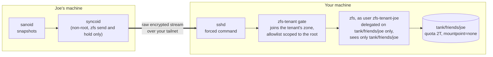

# zfs-tenant

[](https://pypi.org/project/zfs-tenant/)
[](https://pypi.org/project/zfs-tenant/)
[](LICENSE)
[](https://github.com/basnijholt/zfs-tenant/actions/workflows/ci.yml)
[](https://zfs-tenant.nijho.lt)


<!-- SECTION:intro:START -->

Give a friend a quota-capped corner of your ZFS pool for their encrypted backups, without giving them a shell or a look at your data.

> [!NOTE]
> Your friend pushes raw encrypted snapshots with plain `zfs send` or syncoid.
> OpenZFS delegation (`zfs allow`) keeps them inside one dataset you created for them, a small SSH forced command (the *gate*) makes sure the only thing their key can run is the handful of `zfs` commands a backup needs, and `zfs zone` makes the kernel hide the rest of your pool from those commands.
> Their keys never leave their house, so you can never read what they store.
> There is no VM or iSCSI involved.

<!-- SECTION:intro:END -->

## Table of Contents

<!-- START doctoc generated TOC please keep comment here to allow auto update -->
<!-- DON'T EDIT THIS SECTION, INSTEAD RE-RUN doctoc TO UPDATE -->

- [Why](#why)
- [How it works](#how-it-works)
- [Security model](#security-model)
  - [What it cannot hide](#what-it-cannot-hide)
  - [Residual risks](#residual-risks)
- [Quick start on NixOS](#quick-start-on-nixos)
- [Manual setup (TrueNAS SCALE or any Linux)](#manual-setup-truenas-scale-or-any-linux)
- [Pushing with syncoid by hand](#pushing-with-syncoid-by-hand)
- [Restoring](#restoring)
- [Removing datasets](#removing-datasets)
- [What the gate allows](#what-the-gate-allows)
- [FAQ](#faq)
- [Development](#development)
- [License](#license)

<!-- END doctoc generated TOC please keep comment here to allow auto update -->

<!-- SECTION:why:START -->

## Why

A friend with a ZFS box is the cheapest off-site backup there is: you store their snapshots, they store yours.
The hard part is trust.
Nobody wants to hand a friend root, or even a shell, on the machine that holds their family photos.

A friend and I used to solve this [with a TrueNAS VM on top of an iSCSI zvol](https://www.nijho.lt/post/truenas-remote-backups/), so each of us could be root inside a disposable VM instead of on the real NAS.
It worked, but it was a lot of machinery for what is really a permissions problem.

OpenZFS already has the permission system: `zfs allow` can delegate `receive`, `create`, and `destroy` on one dataset to an unprivileged user, and a root-owned `quota` caps how much that user can store.
syncoid already works with such a user (`--no-privilege-elevation`).
What delegation alone does not do is stop that user from listing every dataset on your machine, or from running anything else once they can log in.
zfs-tenant closes that gap twice: a forced command that only runs backup commands, and a user namespace that `zfs zone` restricts to the friend's own datasets.
It also comes with a setup command and a NixOS module that turn the host side into a few lines of config; the sending side is plain syncoid.

<!-- SECTION:why:END -->

<!-- SECTION:how-it-works:START -->

## How it works



The kernel is the jail; the gate removes the shell.

1. **The tenant root.** `zfs-tenant setup` creates `tank/friends/joe`, sets a quota, dataset and snapshot limits, and properties that make sure nothing under it is ever mounted, shared, or exposed as a device. Joe cannot change any of them.
2. **Delegation.** On the root itself, Joe's local user may only create and receive children. Below it, he may also destroy and send. OpenZFS checks these rights in the kernel on every operation, whatever program asks.
3. **The gate.** Joe's SSH key is pinned to `zfs-tenant gate` with `restrict,from=...,command=...` in `authorized_keys`. The gate parses the requested command, accepts only the forms syncoid and a restore need, checks that every dataset is inside Joe's root, and runs `zfs` with an argument list it builds itself. It never starts a shell.
4. **The zone.** A small service keeps a Linux user namespace alive for Joe, in which his uid maps to itself, and `zfs zone` attaches his root to it with `zoned=on`. The gate joins that namespace before it does anything, and the ZFS kernel module then answers `dataset does not exist` for every dataset that is not Joe's. Joe keeps his own uid in there, so he holds no capabilities and `zfs allow` still decides what he may change. If the service is down, the gate refuses to run.
5. **Raw sends.** Joe sends with `zfs send -w`, so his blocks arrive still encrypted with his key. That is what keeps his data private. As a check on the sender's configuration, the gate refuses to receive into an existing unencrypted dataset, and after a receive succeeds it destroys any new dataset that arrived unencrypted and fails the push. An interrupted receive skips that cleanup and can leave partial plaintext behind. This makes a misconfigured sender visible, but it cannot undo the disclosure: the plaintext has already reached your disk.

<!-- SECTION:how-it-works:END -->

<!-- SECTION:security-model:START -->

## Security model

| Promise | Enforced by |
|---|---|
| Joe cannot touch your datasets | delegation exists only on his root; `receive`, `destroy`, `send`, `set`, and `allow` anywhere else fail with `permission denied` in the kernel |
| Joe cannot delete or reconfigure his root | the root only delegates `create,mount,receive` locally; `destroy`, `snapshot`, `set quota`, and `allow` on it are denied |
| Joe cannot see your datasets | the gate rejects any name outside his root before calling `zfs`, allowlists which properties `zfs list` may show, and answers syncoid's `ps` and `command -v` probes with nothing |
| ...even if the gate had a bug | everything runs inside Joe's zone, where the kernel hides every dataset that is not his; with `zoned=on`, his delegated rights only work from inside that zone |
| Joe cannot store more than you agreed | `quota` on the root, set by root |
| Joe cannot flood you with datasets or snapshots | `filesystem_limit` and `snapshot_limit`, which OpenZFS enforces for exactly this kind of delegated user |
| You cannot read Joe's data | raw sends from Joe's side; after a successful receive, the gate destroys any new unencrypted dataset and fails the push (an interrupted receive skips that cleanup), which exposes a misconfigured sender but cannot unsend the plaintext |
| Nothing of Joe's ever gets mounted or shared on your machine | `zoned=on` (the host never mounts zoned datasets, so it never shares them), plus `mountpoint=none`, `canmount=off`, `readonly=on`, `exec=off`, `setuid=off`, `devices=off`, `volmode=none` on the root; the gate always receives with `-u`; property overrides inside a stream fail with `permission denied` |
| Joe's key cannot run anything else | the forced command; the gate never uses a shell |

Every row is exercised by a two-node NixOS VM test with real OpenZFS and real syncoid ([`nix/integration-test.nix`](https://github.com/basnijholt/zfs-tenant/blob/main/nix/integration-test.nix)).

<!-- SECTION:security-model:END -->

<!-- SECTION:cannot-hide:START -->

### What it cannot hide

OpenZFS encryption protects file contents, not structure.
From `zfs-load-key(8)`: *"ZFS will not encrypt metadata related to the pool structure, including dataset and snapshot names, dataset hierarchy, properties, file size, file holes, and deduplication tables."*
So you, as the host, can see the names, sizes, and snapshot times of Joe's datasets.
Give datasets you send to a friend boring names, and never send with `-p` or `-R`, which would include properties.

You are also root on your own machine.
You can always delete Joe's backup copy, even though you can never read it.

<!-- SECTION:cannot-hide:END -->

<!-- SECTION:residual-risks:START -->

### Residual risks

- The kernel parses the send streams Joe sends you. That is the same exposure as any ZFS replication.
- A leaked tenant key lets someone push data up to the quota and delete that tenant's backups.
- Inside a zone, pool-level information (`zpool list`, `zpool status`) and the parent datasets' sizes are still visible to `zfs`. The gate does not allow those commands; the zone only matters if the gate is bypassed.
- syncoid 2.3.0 pastes the resume token it gets from the receiving host into a shell on the sending machine without escaping it, so a malicious host could run commands on the sender as the user running syncoid.
  So run syncoid as a dedicated user that holds only `send` and `hold` rights on the datasets it pushes.
  The NixOS example below does this with `services.syncoid`; by hand, use `zfs allow -u <user> send,hold <dataset>`.

<!-- SECTION:residual-risks:END -->

<!-- SECTION:quick-start-nixos:START -->

## Quick start on NixOS

Add the flake to the host:

```nix
{
  inputs.zfs-tenant.url = "github:basnijholt/zfs-tenant";

  outputs = { nixpkgs, zfs-tenant, ... }: {
    nixosConfigurations.nas = nixpkgs.lib.nixosSystem {
      system = "x86_64-linux";
      modules = [
        zfs-tenant.nixosModules.host
        ./configuration.nix
      ];
    };
  };
}
```

On the host, give Joe a tenant root:

```nix
services.zfs-tenant = {
  enable = true;
  tenants.joe = {
    dataset = "tank/friends/joe";
    quota = "2T";
    authorizedKeys = [ "ssh-ed25519 AAAAC3NzaC1lZDI1NTE5AAAA... joe-nas" ];
    allowedFrom = [ "100.64.0.12" ];  # Joe's tailnet address
  };
};
```

This creates the user `zfs-tenant-joe`, pins the key to the gate, applies the dataset, properties, and delegation on every boot, and runs `zfs-tenant-zone-joe.service`, which holds Joe's zone.
The host needs OpenZFS 2.2 or newer for `zfs zone`.
Set `reservation = "2T";` as well if you want to guarantee Joe the space and hide how full your pool is.

Joe needs nothing from zfs-tenant: he pushes with nixpkgs' own `services.syncoid`.
The VM test runs this configuration, with only its host name, pool, and key changed:

```nix
programs.ssh.knownHosts.bas-nas.publicKey = "ssh-ed25519 AAAAC3NzaC1lZDI1NTE5AAAA...";

services.syncoid = {
  enable = true;
  sshKey = "/var/lib/syncoid/id_ed25519";
  # The default also grants snapshot, destroy, bookmark, and mount.
  localSourceAllow = [
    "send"
    "hold"
  ];
  commonArgs = [
    "--no-sync-snap"
    "--compress=none"
    "--delete-target-snapshots"
    "--sshoption=StrictHostKeyChecking=yes"
  ];
  commands."tank/offsite" = {
    target = "zfs-tenant-joe@bas-nas:tank/friends/joe/offsite";
    recursive = true;
    sendOptions = "w";
  };
};
```

`services.syncoid` runs syncoid hourly as the unprivileged `syncoid` user in a sandbox, always passes `--no-privilege-elevation`, and grants `localSourceAllow` only for the duration of each run.
*Pushing with syncoid by hand* explains the other flags.

Create the key once, readable only by the `syncoid` user, and send Joe's public half to the host:

```bash
sudo install -d -m 700 -o syncoid -g syncoid /var/lib/syncoid
sudo -u syncoid ssh-keygen -t ed25519 -N '' -f /var/lib/syncoid/id_ed25519
```

The source dataset (`tank/offsite` here) must be encrypted, and sanoid should snapshot it: with `--no-sync-snap`, syncoid only sends the snapshots sanoid made.
A failed push shows up in `systemctl status syncoid-tank-offsite`.
To get alerted, monitor the age of the newest snapshot that reached the host for each dataset you push (`zfs list -r -t snapshot -o name,creation -s creation` through the gate), so one healthy dataset cannot hide another that stopped replicating; this also catches a timer that never runs.

On the tailnet, allow only Joe's node to reach port 22 on your host.

<!-- SECTION:quick-start-nixos:END -->

<!-- SECTION:manual-setup:START -->

## Manual setup (TrueNAS SCALE or any Linux)

The gate uses only the Python standard library, so a single file is enough.
Download `zfs-tenant.pyz` from the [latest release](https://github.com/basnijholt/zfs-tenant/releases/latest) and keep it on a pool dataset, so it survives appliance updates:

```bash
curl -L -o /mnt/tank/admin/zfs-tenant.pyz \
  https://github.com/basnijholt/zfs-tenant/releases/latest/download/zfs-tenant.pyz
```

Or install it with `uv tool install zfs-tenant` or `pip install zfs-tenant` where that is possible.

1. Create a local user for Joe with a normal login shell such as bash, no password, and no extra groups. sshd runs forced commands through the login shell. On TrueNAS, give the user a home directory on a pool dataset so its `authorized_keys` persists.
2. Preview the initial setup commands, then run setup as root:

   ```bash
   python3 zfs-tenant.pyz setup --root tank/friends/joe --user joe --quota 2T --dry-run
   sudo python3 zfs-tenant.pyz setup --root tank/friends/joe --user joe --quota 2T
   ```

   Delegation and properties live in the pool, so they survive reboots and appliance updates.
   On subsequent runs, setup checks the root's mountpoint and skips resetting it when it is already locally set to `none`; OpenZFS rejects even an unchanged mountpoint write once zoned children inherit it.
3. Produce the `authorized_keys` line and put it in that user's `~/.ssh/authorized_keys`:

   ```bash
   python3 zfs-tenant.pyz authorized-key \
     --gate-command "/usr/bin/python3 /mnt/tank/admin/zfs-tenant.pyz gate --root tank/friends/joe --zfs /usr/sbin/zfs --zpool /usr/sbin/zpool --zone-pid-file /run/zfs-tenant-joe.pid" \
     --from 100.64.0.12 \
     ssh-ed25519 AAAAC3NzaC1lZDI1NTE5AAAA... joe-nas
   ```

4. Start Joe's zone at boot, as root. On TrueNAS, add this as a post-init script:

   ```bash
   nohup python3 /mnt/tank/admin/zfs-tenant.pyz zone --root tank/friends/joe --user joe \
     --pid-file /run/zfs-tenant-joe.pid --zfs /usr/sbin/zfs >/var/log/zfs-tenant-joe.log 2>&1 &
   ```

   `setup` sets `zoned=on`, and the gate command above refuses to run until this holder is up. The kernel must allow unprivileged user namespaces (Debian and NixOS do by default).

<!-- SECTION:manual-setup:END -->

<!-- SECTION:syncoid-by-hand:START -->

## Pushing with syncoid by hand

```bash
syncoid --no-privilege-elevation --no-sync-snap --sendoptions=w --compress=none \
  --recursive --delete-target-snapshots \
  tank/offsite joe@bas-nas:tank/friends/joe/offsite
```

- `--no-privilege-elevation`: the gate refuses `sudo`.
- `--sendoptions=w`: raw sends, so the host never sees plaintext. The gate fails any push that arrives unencrypted.
- `--no-sync-snap`: send sanoid's snapshots instead of creating syncoid's own, so the sending user needs only `send` and `hold`.
- `--compress=none`: raw encrypted data does not compress. The gate reports that `lzop` and `mbuffer` are missing on its side anyway, so syncoid skips them.
- `--delete-target-snapshots`: mirror your sanoid retention on the host.

The receive always runs with `-u` and preserves `-F` when the caller requests it, as syncoid does. This lets ZFS roll back the receiving dataset and remove newer destination snapshots when retention has deleted the newest shared snapshot on the sender but an older common snapshot remains. Without `-F`, such an incremental receive fails even when the host never mounted or modified the backup. Forced receives are limited to datasets strictly below the tenant root and use the existing delegation; omitting `-F` keeps the normal refusal to overwrite divergent receiver state. Keep snapshots you want to preserve on the sender: the destination follows its state and retention, including after missed pushes. If no common snapshot remains, the dataset needs a new full backup.
Run syncoid as a non-root user with `zfs allow -u <user> send,hold <dataset>` on the sending side.

<!-- SECTION:syncoid-by-hand:END -->

<!-- SECTION:restoring:START -->

## Restoring

Pull a snapshot back through the same key and unlock it at home:

```bash
ssh joe@bas-nas zfs send -w tank/friends/joe/offsite/photos@autosnap_2026-09-25_00:00:01_daily \
  | zfs receive -u tank/restored/photos
zfs load-key tank/restored/photos
zfs mount tank/restored/photos
```

If the transfer breaks, resume it with the token your side kept:

```bash
token=$(zfs get -H -o value receive_resume_token tank/restored/photos)
ssh joe@bas-nas zfs send -t "$token" | zfs receive -s -u tank/restored/photos
```

List what the host keeps for you with `ssh joe@bas-nas zfs list -r -t all -o name,used,creation`.

<!-- SECTION:restoring:END -->

<!-- SECTION:removing-datasets:START -->

## Removing datasets

Everything below your root is yours to remove:

```bash
ssh joe@bas-nas zfs destroy -r tank/friends/joe/old
ssh joe@bas-nas zfs destroy tank/friends/joe/offsite@autosnap_2026-01-01_00:00:01_daily
```

<!-- SECTION:removing-datasets:END -->

<!-- SECTION:gate-allows:START -->

## What the gate allows

`D` is a dataset inside the tenant root, `D↓` a dataset strictly below it, `S` a snapshot name.

| Command | Runs |
|---|---|
| `exit`, `echo -n`, `ps -Ao args=` | nothing (exit 0) |
| `command -v NAME` | nothing (exit 1: "not installed") |
| `zpool get -o value -H feature@extensible_dataset POOL` | same, only for the root's pool |
| `zfs get -H name D`, `zfs get -H receive_resume_token D`, `zfs get -H -p used D`, `zfs get -Hpd 1 -t snapshot guid,creation D`, `zfs get -Hpd 1 type,guid,creation D` | same |
| `zfs receive [-s] [-F] [-u] D↓` | `zfs receive -u [-s] [-F] D↓`, then the encryption check |
| `zfs receive -A D↓` | same |
| `zfs destroy [-r] D↓@S[,S...]` | same |
| `zfs destroy D↓@a; zfs destroy D↓@b` (syncoid's chain) | one `zfs destroy D↓@a,b` |
| `zfs destroy [-r] D↓` | same |
| `zfs create [-p] D↓` | same |
| `zfs list [-H] [-p] [-r] [-d N] [-t TYPES] [-o COLUMNS] [-s/-S COLUMN] [D]` | same, `D` defaults to the root; columns come from an allowlist |
| `zfs send [-w] [-L] [-c] [-e] [-R] [-p] [-i/-I ORIGIN] D@S` | same, the origin must be a snapshot of `D` |
| `zfs send -t TOKEN` | same, after checking the token names a snapshot inside the root |

Anything else exits 126 with `zfs-tenant: command not allowed: <reason>`, and every decision is logged to the auth log with the tenant root.
Every allowed command runs inside the tenant's zone.

<!-- SECTION:gate-allows:END -->

<!-- SECTION:faq:START -->

## FAQ

**Why a user namespace but not a full container or VM?**
The part that needs isolating is ZFS, and `zfs zone` isolates exactly that: the kernel filters which datasets a namespace can see.
A container would still need `/dev/zfs`, and the usual container setup makes the tenant root inside its namespace, which ZFS treats as the zone's administrator: that bypasses `zfs allow`, so the tenant could, for example, destroy the root dataset you created for them.
zfs-tenant maps the tenant to its own uid inside the namespace instead, so delegation keeps deciding what it may change.
The old VM setup existed only because TrueNAS replication needed root on the receiving end; delegation removes that need.

**Why a holder service?**
In OpenZFS 2.4, `zfs zone` attaches a dataset to one running namespace, so something has to keep that namespace alive.
OpenZFS master can attach datasets to a uid instead (`zoned_uid`).
Once that is released, it may replace the holder, after checking that its permission and capability rules still leave `zfs allow` in charge.

**Why not zrepl?**
zrepl's sink mode does per-client subtrees, but it replaces sanoid and syncoid on both sides and runs as root on the receiver.
Here the kernel enforces the boundary, and both sides keep the tools they already use.

**Why push instead of pull?**
With pull, the host would need rights on the friend's machine, and the friend could not create or remove datasets on their own.
With push, the friend owns their corner of your pool and you hold no keys to theirs.

**Why Python and not a shell script?**
The gate's input is an untrusted string.
Parsing it in shell invites word splitting and injection; Python gives a real tokenizer, strict allowlists, `exec` of an argument list, and unit tests.
It stays dependency-free so it runs from a single file on appliances.

<!-- SECTION:faq:END -->

<!-- SECTION:development:START -->

## Development

```bash
just install  # uv sync --dev
just test     # unit tests
just lint     # ruff, mypy, ty
just vm-test  # two-node NixOS VM test with real OpenZFS and syncoid
just pyz      # build dist/zfs-tenant.pyz
just docs     # regenerate docs/ from README.md sections and build the site
```

<!-- SECTION:development:END -->

## License

MIT
