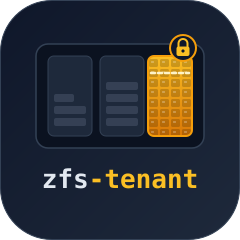
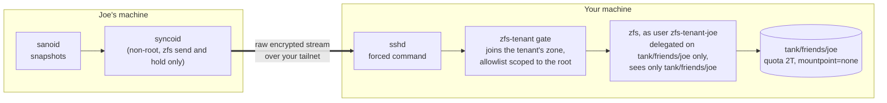

# zfs-tenant

  

<!-- CODE:START -->
<!-- print(include_section("../README.md", "intro", strip_heading=True)) -->
<!-- CODE:END -->
<!-- OUTPUT:START -->
<!-- ⚠️ This content is auto-generated by `markdown-code-runner`. -->
Give a friend a quota-capped corner of your ZFS pool for their encrypted backups, without giving them a shell or a look at your data.

> [!NOTE]
> Your friend pushes raw encrypted snapshots with plain `zfs send` or syncoid.
> OpenZFS delegation (`zfs allow`) keeps them inside one dataset you created for them, a small SSH forced command (the *gate*) makes sure the only thing their key can run is the handful of `zfs` commands a backup needs, and `zfs zone` makes the kernel hide the rest of your pool from those commands.
> Their keys never leave their house, so you can never read what they store.
> There is no VM or iSCSI involved.

<!-- OUTPUT:END -->

  <a href="getting-started/" class="md-button md-button--primary">
    Get started
  </a>
  <a href="https://github.com/basnijholt/zfs-tenant" class="md-button">
    View on GitHub
  </a>

<!-- CODE:START -->
<!-- print(include_section("../README.md", "why")) -->
<!-- CODE:END -->
<!-- OUTPUT:START -->
<!-- ⚠️ This content is auto-generated by `markdown-code-runner`. -->
## Why

A friend with a ZFS box is the cheapest off-site backup there is: you store their snapshots, they store yours.
The hard part is trust.
Nobody wants to hand a friend root, or even a shell, on the machine that holds their family photos.

A friend and I used to solve this [with a TrueNAS VM on top of an iSCSI zvol](https://www.nijho.lt/post/truenas-remote-backups/), so each of us could be root inside a disposable VM instead of on the real NAS.
It worked, but it was a lot of machinery for what is really a permissions problem.

OpenZFS already has the permission system: `zfs allow` can delegate `receive`, `create`, and `destroy` on one dataset to an unprivileged user, and a root-owned `quota` caps how much that user can store.
syncoid already works with such a user (`--no-privilege-elevation`).
What delegation alone does not do is stop that user from listing every dataset on your machine, or from running anything else once they can log in.
zfs-tenant closes that gap twice: a forced command that only runs backup commands, and a user namespace that `zfs zone` restricts to the friend's own datasets.
It also comes with a setup command and a NixOS module that turn the host side into a few lines of config; the sending side is plain syncoid.

How zfs-tenant came together, and what the VM tests turned up along the way, is in the blog post [Friend-to-friend ZFS backups, version two](https://www.nijho.lt/post/zfs-tenant/).

<!-- OUTPUT:END -->

<!-- CODE:START -->
<!-- print(include_section("../README.md", "how-it-works")) -->
<!-- CODE:END -->
<!-- OUTPUT:START -->
<!-- ⚠️ This content is auto-generated by `markdown-code-runner`. -->
## How it works

The examples call the friend Joe.
He is the real friend I built this with, and he stayed in the docs as the example tenant.

The kernel is the jail; the gate removes the shell.

1. **The tenant root.** `zfs-tenant setup` creates `tank/friends/joe`, sets a quota, dataset and snapshot limits, and properties that make sure nothing under it is ever mounted, shared, or exposed as a device. Joe cannot change any of them.
2. **Delegation.** On the root itself, Joe's local user may only create and receive children. Below it, he may also destroy and send. OpenZFS checks these rights in the kernel on every operation, whatever program asks.
3. **The gate.** Joe's SSH key is pinned to `zfs-tenant gate` with `restrict,from=...,command=...` in `authorized_keys`. The gate parses the requested command, accepts only the forms syncoid and a restore need, checks that every dataset is inside Joe's root, and runs `zfs` with an argument list it builds itself. It never starts a shell.
4. **The zone.** A small service keeps a Linux user namespace alive for Joe, in which his uid maps to itself, and `zfs zone` attaches his root to it with `zoned=on`. The gate joins that namespace before it does anything, and the ZFS kernel module then answers `dataset does not exist` for every dataset that is not Joe's. Joe keeps his own uid in there, so he holds no capabilities and `zfs allow` still decides what he may change. If the service is down, the gate refuses to run.
5. **Raw sends.** Joe sends with `zfs send -w`, so his blocks arrive still encrypted with his key. That is what keeps his data private. As a check on the sender's configuration, the gate refuses to receive into an existing unencrypted dataset, and after a receive succeeds it destroys any new dataset that arrived unencrypted and fails the push. An interrupted receive skips that cleanup and can leave partial plaintext behind. This makes a misconfigured sender visible, but it cannot undo the disclosure: the plaintext has already reached your disk.

<!-- OUTPUT:END -->
